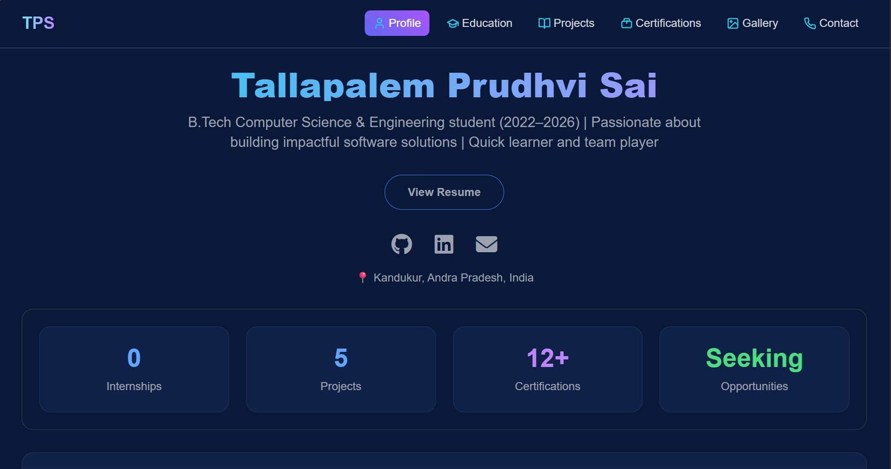

# 🚀 My Personal Portfolio Website

A modern, responsive, and high-performance portfolio website designed to showcase my journey as a developer and data analyst. This site features a custom-built dashboard interface with real-time screen switching and a glassmorphic UI.

[[Live Demo Link Here](https://prudhvisai8.github.io/Portfolio/)] • 

---

## 🛠️ Tech Stack

| Category           | Technology Used                                     |
|--------------------|-----------------------------------------------------|
| **Frontend** | HTML5, Tailwind CSS, JavaScript (ES6+)              |
| **Icons & Assets** | Lucide Icons, Simple Icons, DevIcons                |
| **Form Handling** | Formspree                        |
| **Deployment** | GitHub Pages                 |

---

## ✨ Key Features

- **Dynamic Dashboard UI:** A seamless single-page experience where users can navigate between Profile, Education, Projects, and more without page reloads.
- **Interactive Growth Tree:** A visual representation of my professional journey and learning path.
- **Skill Visualization:** Detailed categorization of technical tools using modern brand icons and hover effects.
- **Automated Contact Form:** A fully functional, validated contact form that delivers messages directly to my inbox.
- **Responsive Design:** Fully optimized for mobile, tablet, and desktop viewing.

---

## 📸 Preview

<p align="center">
  
</p>

---

## 📂 Project Structure

```text
├── assets/
│   ├── images/         # Project screenshots and gallery images
├── index.html          # Main entry point
├── style.css          # Custom styles
└── README.md           # Project documentation
